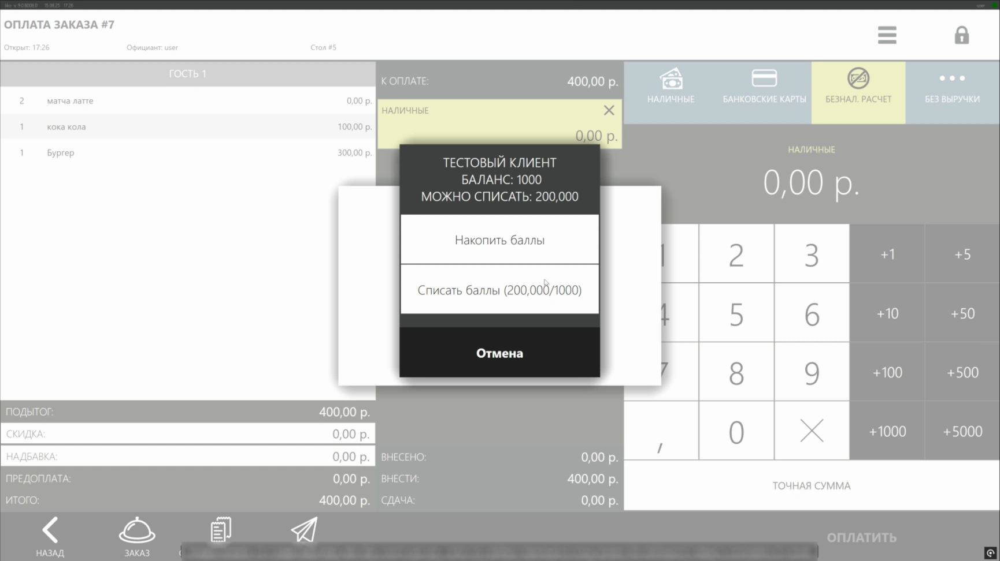

### Плагин Лояльности IIKO

Плагин для ресторанной системы IIKO, позволяющий использовать кастомную систему лояльности.

Длительность: 2 месяца

Стек:
`C# .NET Framework 8`
`RestoFrontAPI 8`
`Docker`

Проектные решения:
- Анализ и моделирование бизнес-процессы с помощью UML диаграмм
- Интеграция плагина в IIKO CMS с помощью IIKO SDK
- Разработка системы шифрования данных, использующую секрет сервера и уникальный токен плагина
- Разработка прокси сервиса, шифрующего данные для тестирования мока бэкенда
- Разработка скрипта для генерации экземпляров плагина в серверном окружении с помощью Docker

<table>
  <tr>
    <td>
      
    </td>
  </tr>
</table>