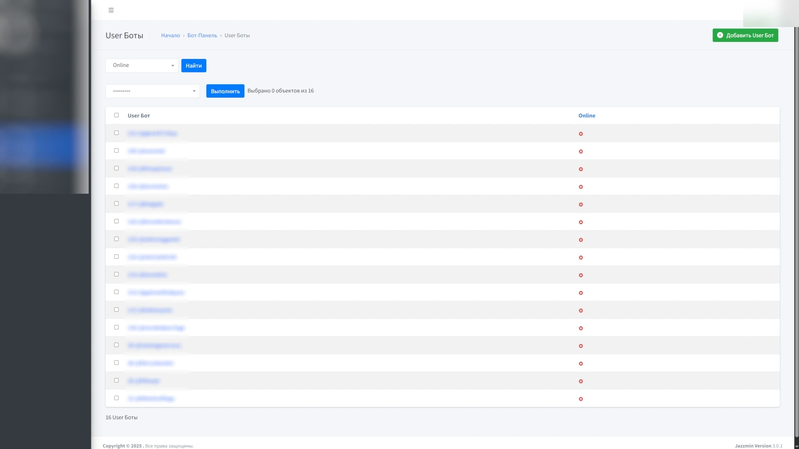
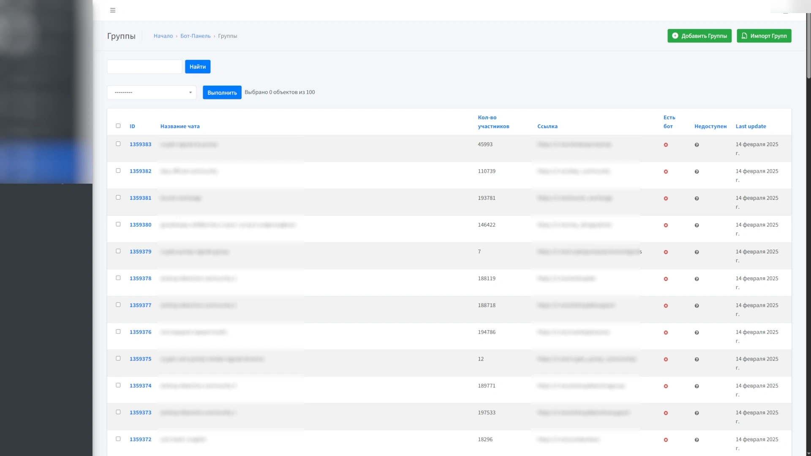
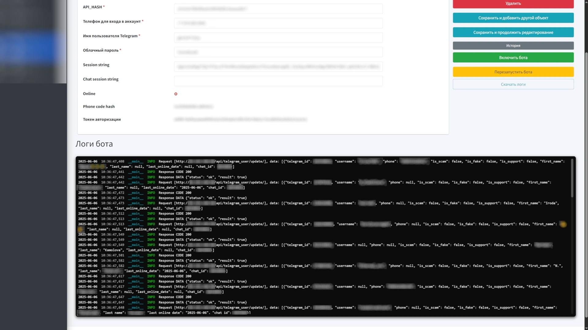
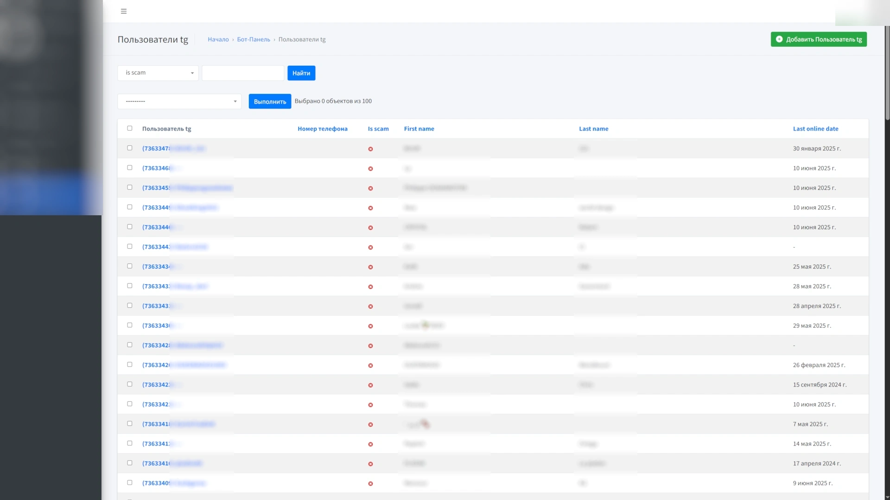
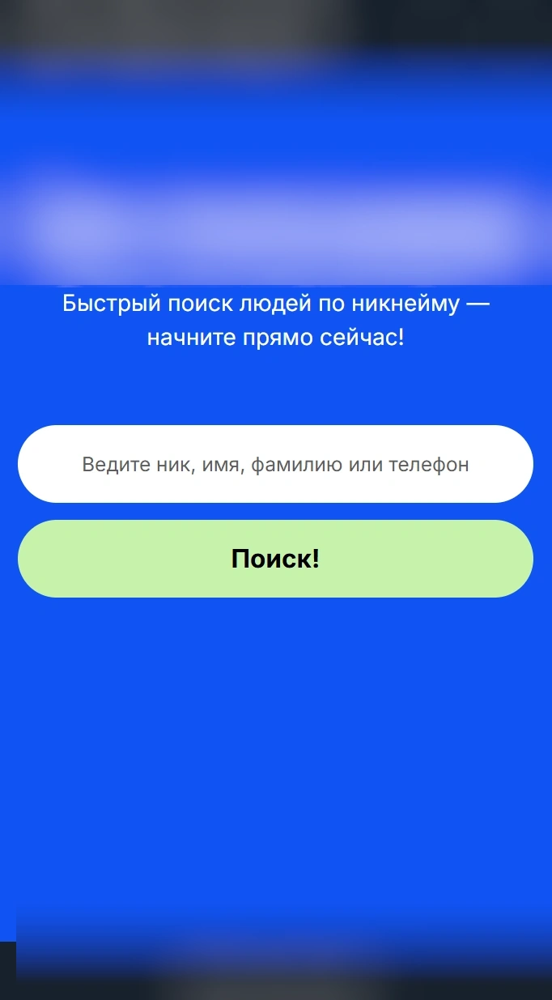
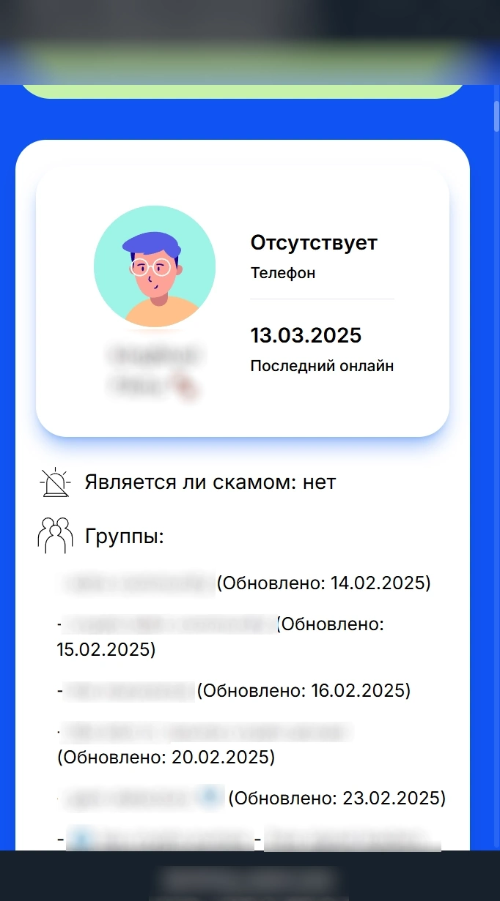

### Оркестратор ТГ Парсеров

Админ панель для управления телеграм-ботами для парсинга групп. Поставляет защищенное API для сбора и хранения данных.

Длительность: 2 месяца

Стек:
`Python 3.11`
`Django 4.2`
`PostgreSQL 15`
`Pyrogram 2`
`Docker SDK`
`Docker`
`Nginx`
`Debian 11`
`Websockets`

Проектные решения:
- Проектирование базы данных
- Оптимизация базы данных и запросов к ней для эффективной работы с большим кол-вом данных (>20М записей)
- Разработка админ панели для создания и управления телеграм-ботами
- Разработка админ-панели для авторизации телеграм-ботов
- Разработка системы авторизации API для телеграм-ботов 
- Разработка телеграм-бота для парсинга информации о телеграм чатах и их участниках
- Разработка системы контейнеризации телеграм-ботов с использованием Docker SDK
- Разработка системы мониторинга за контейнерами с телеграм-ботами в реальном времени, вшитую в админ панель
- Разработка системы управления телеграм-ботами с помощью команд в реальном времени, вшитую в админ панель
- Настройка сервера
- Настройка базы данных
- Автоматизация процесса деплоя с помощью github actions
- Настройка управления инфраструктурой
- Настройка NGINX

<table>
  <tr>
    <td>
      
    </td>
    <td>
      
    </td>
    <td>
      
    </td>
  </tr>
  <tr>
    <td>
      
    </td>
    <td>
      
    </td>
    <td>
      
    </td>
  </tr>
</table>